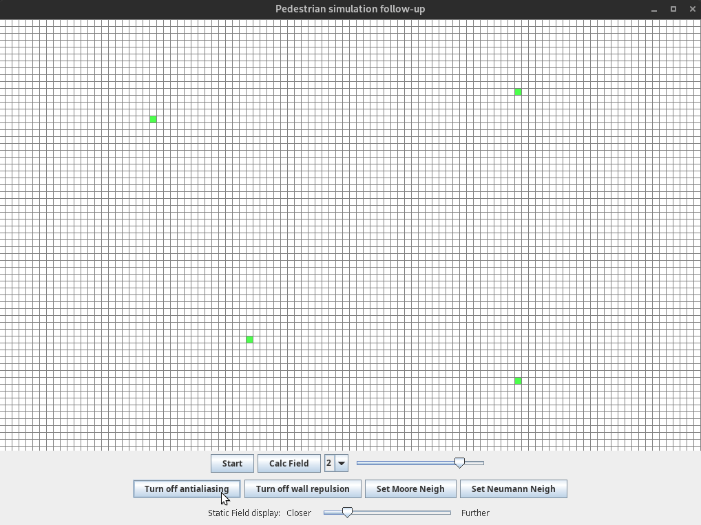

# Pedestrians-follow-up

## A force field based pedestrian simulator using Cellular Automaton

This is an extension of the Pedestrians lab. The first lab had a lot of issues, mainly: often getting to the exit required moving into a field with higher static potential field, which the pedestrian couldn't do. Using techniques mentioned below, the problem has been eliminated. Also, the crowd behaves much more realistically now.

Application supports 

- Moore's neighborhood
- Von Neumann's neighborhood
- Force field is creation is based on Rapidly-exploring Random Trees (RRT)
- Rest of the force field (outside of the tree) is created using BFS (guides the pedestrians towards the RRT paths, called `antialiasing` in the app, since it smoothens out the edges)
- Pedestrians can avoid going close to the walls using the wall repulsion function

There are four kinds of  cells:

-  0 - White cells - Represent the Floor
-  1 - Red cells - Represent a wall
-  2 - Green cells - Each cell is an exit
-  3 - Blue cells - Pedestrian

### Used techniques:

- I have added a force field to the walls, so the pedestrians try to avoid going too close to them
- **My idea:** using RRTs for static field generation

### Rationale

Why not just use a BFS, which obeys the walls starting from each exit? 

- Real pedestrians don't always follow the optimal path. Most often they don't have the full information and choose a sub-optimal path to reach the destination. Moreover the crowd will usually follow a path set by the initial leader (they don't have more information than the leader, so they also choose the sub-optimal path, especially that they know the leader successfully got to the exit using that path), using and RRT guarantees that those rules get fulfilled, even though it exaggerates them a bit.

Generating an RRT is slow

- The RRT gets generated only after we change the settings. After the generation no further steps are needed, so speed is not an issue.

### A demo of the application:

#### Without the anti-aliasing (just RRT):

