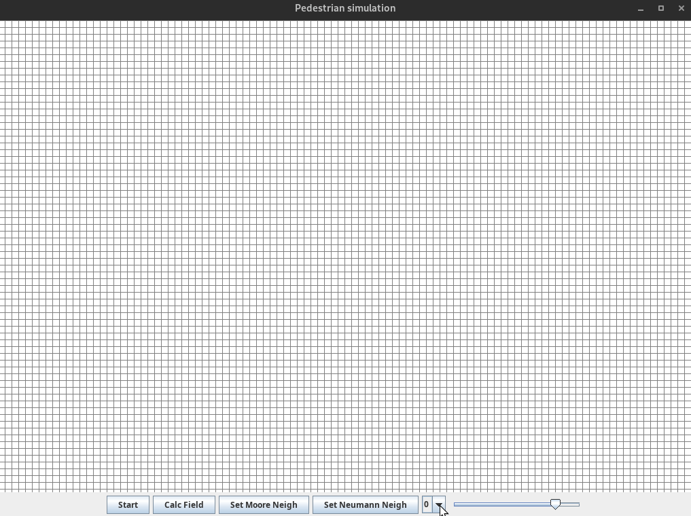

# Simple Pedestrians

### A simple force field based pedestrian simulator using Cellular Automaton

Each of the exits creates a force field, which the pedestrian uses for navigating to it

Application supports 

- Moore's neighborhood
- Von Neumann's neighborhood

There are four kinds of  cells:

-  0 - White cells - Represent the Floor
- 1 - Red cells - Represent a wall
- 2 - Green cells - Each cell is an exit
- 3 - Blue cells - Pedestrian

### A demo of the application:

